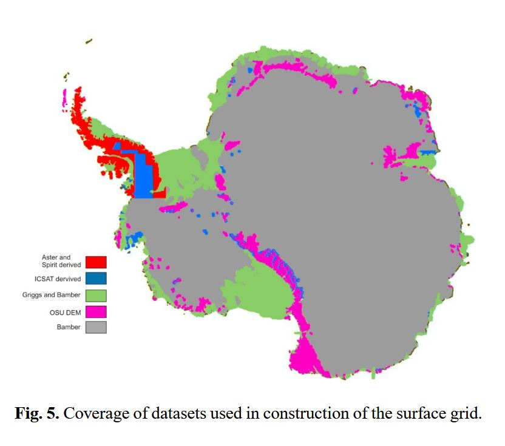
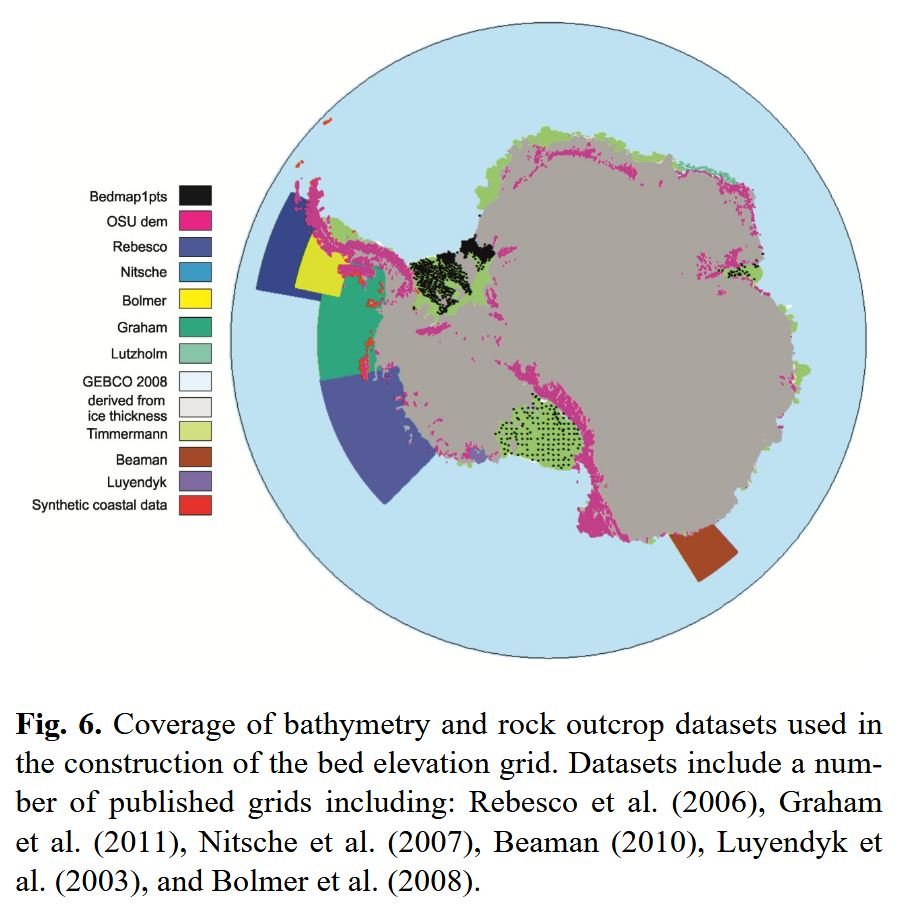

# RIS_gravity_inversion
Here we use gravity data from Antarctica's Ross Ice Shelf region, mainly airborne data from the ROSETTA-Ice project, to perform a gravity inversion to model the sub-ice shelf bathymetry.

## Getting the code

You can download a copy of all the files for this project by cloning the GitHub repository:

    git clone https://github.com/mdtanker/RIS_gravity_inversion

## Dependencies

Install the required dependencies with either `conda` or `mamba` with the environment.yml file:

    cd RIS_gravity_inversion

    make install

Activate the newly created environment:

    conda activate RIS_gravity_inversion

If you get errors related to the PyProj EPSG database, try the following:

    mamba install -c conda-forge proj-data --force-reinstall -y

or

    conda remove --force pyproj -y
    pip install pyproj --force-reinstall

Open and work through `RIS_inversion.ipynb` to see an example of the inversion.

## Initial environment creation / updating

create the initial conda environment with the following make command:

    make conda_env

Export this new environment to an `environment.yml` file.

    make conda_yml

This will solve the dependencies of all the conda-specific packages and install them. Try to include as many packages as possible in this single conda install command. Only explicitly pin packages in this command if it's necessary, try and let conda do the work.

To install a pip package, manually add it to the bottom of the yml file, like this:

    - ....
    - pip:
        - numba-progress

To update the environment, manually add any new conda or pip packages to the .yml file and run the following:

    conda activate RIS_gravity_inversion
    make conda_update

## Data sources

### Bedmap2
Surface Coverage | Bed Coverage
:---:|:---:
|

For the Ross Ice Shelf:
* surface elevation from satellite altimetry (Griggs and Bamber, 2011)
* ice thickness from satellite altimetry measurements of freeboard (Griggs and Bamber, 2011)
* bed from Timmerman et al. 2010

## To Do

### Inversion-specific
#### Features
* look into GMT gravprisms for method comparison, or for vertically varying density (via stacks of prisms)
* increase grid spacing of buffer zone
    * use discretize package, rioxarray.pad_box or xarray.pad
* implement depth-dependent density
    * both ice and sediment (like harmonica.tesseroid_gravity)

* for gmt surface:
    * from Scheinert et al. 2016 "It is recommended to use values of 0.25, ... , 0.3 for potential field data, whereas a larger tension factor (0.35) should be used for topography data [Wessel and Smith, 2015]. Here a tension factor of 0.3 was utilized."
    * use this for creating a surface between constraint points

#### Bugs
* test with layers with NaN's (instead of ice and water elev = 0 for no ice, make nans)
* fix Gauss-Newton Least Squares Solution
* fix Steepest Descent Least Squares Solution
* fix density inversion
* fix Jacobian calculation with annulus
#### Improvements
* use xrft for coherency and power spectrum: https://xrft.readthedocs.io/en/latest/MITgcm_example.html
* use xrscipy for coherency and spectra: https://xr-scipy.readthedocs.io/en/latest/spectral.html
* use vd.median_distance for constraints grid construction
* use xarray-spatial proximity for constraints grid: https://xarray-spatial.org/user_guide/proximity.html
* use rioxarray.reproject_match for resampling
* use hm.EquivalentSources.jacobian to calculate jac.
* use Dask Bags to parallelize forward grav calculations of a dict of prism layers
#### Misc
* add hm.EquivalentSources as method for regional calc
* use vd.Trend.jacobian for regularization
* use vd.base.least_squares for optimization
* add spacing parameter to grdfilters

### Other
#### Features
* use rosetta ice thickness
* do forward model with rosetta density
* use Boule to remove normal gravity
    - using rosetta "FAG_levelled" channel
#### Bugs
* fix constraints on GL plotting
* fix pyvista to work on remote server
    * use pvxarray for plotting topographies in 3D

## Questions:
* should we use raw gravity observation points or interpolated grid?

## Other Gravity Inversion Software

### Geosoft Oasis Montaj
* 3D
* Square grid network

### MiraGeoscience
* 3D
* offer Vertical Prisms inversion

### Fatiando a Terra / Harmonica

### SimPEG
* 3D
* mesh-based, not well suited (yet) for vertical prism inversion

### PyGIMLI
* 3D
* mesh-based

### GNS Woodward Fortran Code
* 3D
* Triangular grid network
* Irregular grid spacing
* Accepts constraint cells

### GNS Nagy / Woodward Python Code
* 3D
* Same optimization of GNS fortran code
* Square grid network
* different grid spacing for each layer

### Growth 3.0 Fortran Code
* 3D
* accepts seeds
